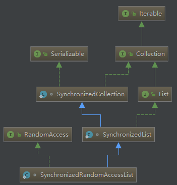

# CopyOnWriteArrayList与Collections#synchronizedList如何保证线程安全

**作者：** keelic  
**日期：** 2018-03-15  
**标签：** 源码, jdk , CopyOnWriteArrayList,  Collections#synchronizedList

---

## 0. 概述
ArrayList和LinkedList的实现不是同步的。主要存在两个方面的问题：
1. 在一方对非同步list进行遍历，而另一方对其进行修改时`（包括调用list本身的方法修改）`，会抛出ConcurrentModificationExcpetion异常。  
2. 多个线程对非同步list进行并发修改时，会导致数据丢失。

围绕着解决这两个问题，jdk提供了Collections#synchronizedList同步包装方法和CopyOnWriteArrayList并发类。  
总的来说，它们有如下特点：  
1. Collections#synchronizedList方案解决了问题2，但是问题1依然存在，且处处都有锁，读效率不高。
2. CopyOnWriteArrayList能同时解决问题1和2，读操作没有加锁，读效率高。但是每次作结构性修改的时候，都要将底层数据组复制一遍，耗费内存，
写效率会受影响，应用于`多读少改`的场景比较合适。只能保证数据最终一致性，不能保证实时一致性。

## 1. Collections#synchronizedList同步包装方法
Collections#synchronizedList同步包装方法能够解决问题2，但是问题1依然存在。  

**原理：** 简单除暴的加锁，对读写方法全部用synchronized关键字进行同步。

实现方法
```java
public static <T> List<T> synchronizedList(List<T> list) {
    return (list instanceof RandomAccess ?
        new SynchronizedRandomAccessList<>(list) :
        new SynchronizedList<>(list));
}
```
SynchronizedRandomAccessList和SynchronizedList类的继承关系：  
  
ArrayList实现了RandomAccess接口，同步包装方法会返回一个SynchronizedRandomAccessList实例。
通过类的继承关系可以看出，是SynchronizedList实现了List接口，那么对list接口方法进行同步处理的实现就应该在SynchronizedList中。
SynchronizedList同步原理很是简单粗暴：所有方法都使用synchronized关键字进行同步`（两个listIterator方法除外）`
```java
static class SynchronizedList<E> extends SynchronizedCollection<E> implements List<E> {

    // 保存被包装的list实例对象，所有List接口都对这个私有属性进行操作
    final List<E> list;

    SynchronizedList(List<E> list) {
        super(list);
        this.list = list;
    }

    // 加锁，锁对象mutex在其父类SynchronizedCollection中定义
    public void add(int index, E element) {
        synchronized (mutex) {list.add(index, element);}
    }

    // 省略其它方法。该类中除了以下两个listIterator方法之外的
    // 所有public方法都使用了synchronized关键字进行了同步处理
    // 甚至包括equals和hashCode都进行了同步处理

    // 必须由用户手动进行同步处理。
    // 注意：用与加锁的对象，必须与mutex是同一个对象
    public ListIterator<E> listIterator() {
        return list.listIterator(); // Must be manually synched by user
    }

    public ListIterator<E> listIterator(int index) {
        return list.listIterator(index); // Must be manually synched by user
    }
```
了解了SynchronizedList同步原理以后，还有一个重要的问题：用于锁的对象mutex到底是什么？  
看看SynchronizedCollection类的实现：
```java
static class SynchronizedCollection<E> implements Collection<E>, Serializable {

    final Collection<E> c;  // Backing Collection
    // 用于同步锁的对象
    final Object mutex;     // Object on which to synchronize

    SynchronizedCollection(Collection<E> c) {
        this.c = Objects.requireNonNull(c);
        // 就是实例本身
        mutex = this;
    }
	
	// 其它方法省略，总的来说也是简单除暴的进行加锁处理
}
```
SynchronizedCollection构造函数中可以知道，用于锁的对象就是实例本身。问题解决：  
`List list = Collections.synchronizedList(new ArrayList());`在同步处理过程中，**用户锁的对象就是获取到的这个list实例。**  
因此，可以得出listIterator正确的加锁方式如下：
```java
// 正确的加锁方式：需要对同步包装方法返回的对象进行加锁
List list = Collections.synchronizedList(new ArrayList());
    ...
synchronized (list) {//锁对象一定要是list
    // 注意：获取迭代器的iterator()方法必须在同步代码块内部
    Iterator i = list.iterator(); // Must be in synchronized block
    
    while (i.hasNext())
        foo(i.next());
}


// 不正确的加锁方式。关于这个问题，网上有很多讨论
Object lock = new Object();
List list = Collections.synchronizedList(new ArrayList());
    ...
synchronized (lock) {//锁对象不是list实例
    // 注意：获取迭代器的iterator()方法必须在同步代码块内部
    Iterator i = list.iterator(); // Must be in synchronized block
    
    while (i.hasNext())
        foo(i.next());
}
```

Collections.synchronizedList(List<T> list)还有一个重载的方法，可以供调用者从外部传入一个锁对象mutex：  
```java
static <T> List<T> synchronizedList(List<T> list, Object mutex) {
    return (list instanceof RandomAccess ?
            new SynchronizedRandomAccessList<>(list, mutex) :
            new SynchronizedList<>(list, mutex));
}
```

**总结：**  
1. Collections.synchronizedList返回list对象的所有读写操作都用synchronized关键字进行了同步处理，且锁住的就是
实例本身，实际上就是读写操作串行化了。因此，能够解决问题2，但是读的执行效率会受到影响。  
2. Collections.synchronizedList方案不能解决问题1，如下代码还是会抛出ConcurrentModificationExcpetion异常。
```java
public void ConcurrentModificationExceptionTest(){
    List<Integer> list = Collections.synchronizedList(new ArrayList<Integer>(3));
    list.add(1);
    list.add(2);
    list.add(3);

    synchronized (list){
        Iterator<Integer> iterator = list.iterator();
        while (iterator.hasNext()){
            Integer it = iterator.next();
            // 遍历的同时调用list本身的方法对其做结构性修改
            if(it == 3)
                list.remove(it); // 应该使用iterator.remove()来删除
        }
    }
}
```

## 2. CopyOnWriteArrayList并发类
JDK中提供了CopyOnWriteArrayList并发类能同时解决问题1和问题2。  

**原理：** 
所有的读操作都在容器的当前数组上进行，读操作不加锁。所有的写操作不在容器当前数组上进行，而是采用CopyOnWrite机制，即`写时复制`。通俗来说就是对容器作写操作的时候，不会直接操作容器的当前数组，而是对当前数组copy出一个新数组，然后对这个新数组进行写操作，完成以后将容器的当前引用指向新数组。随后的读操作也会被转移到新数组上。

add/remove/set操作都采用CopyOnWrite机制。写操作会加锁，防止多个线程并发写时会复制出多个数组副本，耗费内存，线程间的写还会互相覆盖。
```java
public boolean add(E e) {
    // 写操作是需要加锁的，防止多个线程同时写会复制出多个副本
    final ReentrantLock lock = this.lock;
    lock.lock();
    try {
        Object[] elements = getArray();
        int len = elements.length;
	// 在当前数组基础上copy出一个新数组
        Object[] newElements = Arrays.copyOf(elements, len + 1);
	// 对新数组进行写操作
        newElements[len] = e;
	// 写操作完成后，将容器当前引用指向新的数组
        setArray(newElements);
        return true;
    } finally {
        lock.unlock();
    }
}
```

所有读操作在容器当前数组上进行，不加锁：
```java
public E get(int index) {
    return get(getArray(), index);
}
```

CopyOnWrite是一种程序设计中的优化策略，体现了`读写分离`的思想，能够同时解决问题1和问题2。  

但是，CopyOnWrite有两个缺陷，在编程时需要注意：  
1. 数据一致性问题。CopyOnWrite容器只能保证数据的最终一致性，不能保证数据的实时一致性。所以如果你希望写入的的数据，马上能读到，请不要使用CopyOnWrite容器。  
2. 内存占用问题。在写操作发生时，容器中会存在两份数据`（用于读的当前数组，以及用于写的数组副本）`。
